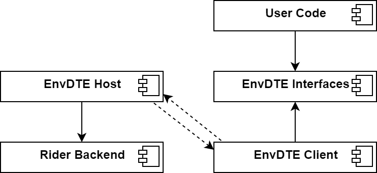

[](https://confluence.jetbrains.com/display/ALL/JetBrains+on+GitHub)
[](https://ci.appveyor.com/project/kirillgla/jetbrains-envdte)

JetBrains.EnvDTE
====

Note
----
This is still a work-in-progress project in its early stage.

Why mock EnvDTE?
----
*The problem*:  
Many projects use `EnvDTE` interfaces, which currently can only be accessed from a Microsoft Visual Studio instance.
 Such projects cannot migrate to Rider.

*The solution*:  
This project creates an assembly that looks exactly like Visual Studio EnvDTE, but can be obtained inside JetBrains Rider.

Instead of accessing COM, this DTE mock uses RD protocol to access project model info built by Rider

Architecture
----
EnvDTE provides the API to access project model and AST model; the EnvDTE API is reasonably similar to the one of ReSharper,
which makes it possible to write a kind of adapter between EnvDTE API and ReSharper API, which is exactly what this project is.

Since EnvDTE in Rider has to conform to the original EnvDTE interfaces and is primarily required to be loaded into a process with user code,
it has to be separated into three main parts: the `EnvDTE.Interfaces.dll` (the library that imitates the API of the original library),
the `EnvDTE.Client.dll` (the library that contains implementation of those interfaces), and `EnvDTE.Host.dll` (the library )

The `EnvDTE.Client.dll` is the library that is supposed to be loaded into the user code; it translates any call to EnvDTE API to synchronous RD calls.  
The `EnvDTE.Host.dll` is the library that has an architecture of a Rider plugin backend;
when loaded into Rider backend runtime and initialized, it handles the the requests from the user code process
and delegates them to the platform infrastructure.


Build instructions:
----
```powershell
.\build.ps1
```
or
```bash
bash build.sh
```

That creates libraries in `artifacts` folder.
They should be thereafter loaded into proper processes by some means that are outside of the scope of this project.

Coursework text
----
This code was created as result of a coursework in St Petersburg University by Kirill Glazyrin in 2019-2020.
The text of the coursework is available on demand.
